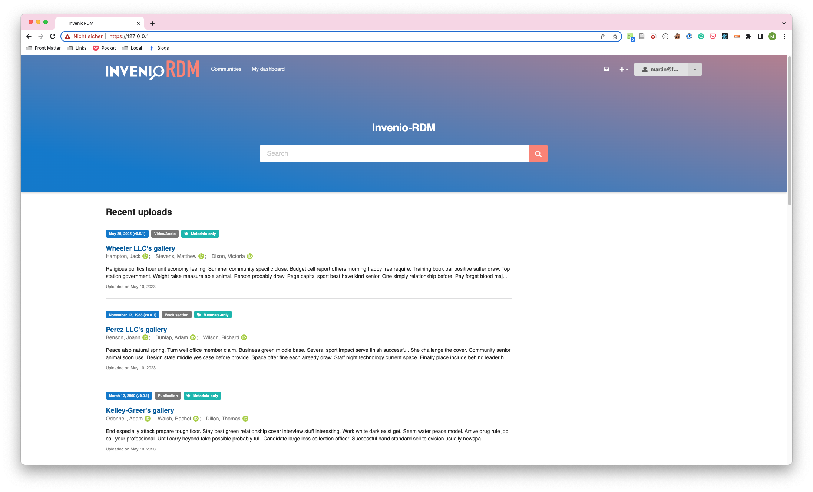

# docker-invenio-rdm

Docker Compose configuration for [InvenioRDM](https://inveniordm.docs.cern.ch/), the turn-key research data management repository.

[Compose](https://docs.docker.com/compose/) is a part of the Docker application, used for defining and running multi-container Docker applications. With Compose, you use a YAML file to configure your application's services. 

The Compose file included here uses existing Docker images for InvenioRDM and its dependencies. It does not build images from source, and it does not have other dependencies besider Docker itself. The initial setup of InvenioRDM should not take more than 15 minutes.

Compose is the easiest way to run [InvenioRDM](https://inveniordm.docs.cern.ch/). This makes Docker Compose perfect for testing and staging environments. It is not recommended to use it in production, for production deployments, use a container orchestrator such as [Kubernetes](https://kubernetes.io/), [OpenShift](https://docs.openshift.com/), [Elastic Container Service](https://aws.amazon.com/ecs/), or [Nomad](https://www.nomadproject.io/).

More work is needed to set up development environments with Compose, for now please use [invenio-cli](https://github.com/inveniosoftware/invenio-cli) and follow the [instructions](https://inveniordm.docs.cern.ch/develop/getting-started/instance-development/]) in the InvenioRDM documentation.

## Getting Started

1. [Install Docker](https://docs.docker.com/install/)
1. [Clone this repository](https://docs.github.com/en/repositories/creating-and-managing-repositories/cloning-a-repository)
1. Start Compose with `docker compose up`
1. Access the InvenioRDM application at `https://127.0.0.1` (web frontend) or `https://127.0.0.1/api/records` (REST API).

## Customization

* Override the default environmental variables by using custom environmental variables in a `.env` file. Use `.env.example`as a starting point. 
* Override the default configuration by creating an `docker-compose.override.yml` file. Use `docker-compose.override.yml.example` as a starting point.
* More info on [Customizing InvenioRDM](https://inveniordm.docs.cern.ch/customize/)

## Documentation

Detailed InvenioRDM documentation is [here](https://inveniordm.docs.cern.ch/).

## License

This project is licensed under the MIT License - see the [LICENSE](LICENSE) file for details.